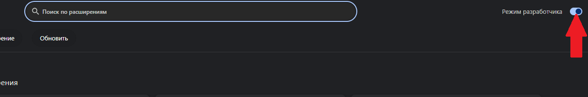
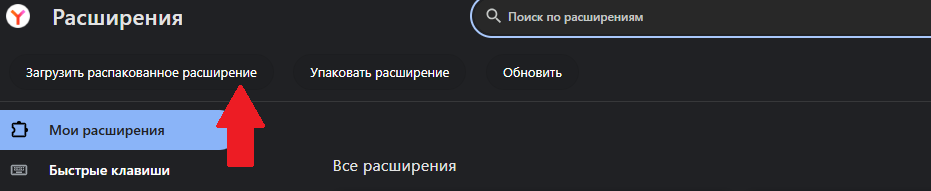

# ИНТЕРСКОЛ расширение для браузеров 🔍

Описание: Это удобное браузерное расширение создано для быстрого и эффективного поиска наличия запчастей в вашем браузере Chrome / Яндекс Браузер / Opera.

Функционал ⚙️

✅ Быстрый поиск по введённому номеру детали.

✅ Удобный и простой интерфейс с минималистичным дизайном.

✅ Возможность перейти сразу в систему GIS.

## Инструкция по установке 🛠️

Чтобы начать пользоваться нашим расширением, следуйте простым шагам установки для Google Chrome:

1. Скачайте архивные файлы 📥

Скачайте архив с файлами расширения
2. Настройки расширений в Chrome 🌐

Откройте браузер и перейдите по ссылке:

    |Браузер|Ссылка|
    |---|---|
    |Chrome|  <a href='chrome://extensions'>chrome://extensions/</a>|
    Яндекс Браузер|<a href='browser://extensions'>browser://extensions/</a>|
    Опера|<a href='opera://extensions/'>opera://extensions/</a>|

3. Режим разработчика 👨‍💻

Активируйте режим разработчика на странице расширений, в правом верхнем углу странциы.

4. Установите расширение вручную 📦

Нажмите кнопку «Загрузить распакованное расширение».

Укажите путь к каталогу, содержащему извлечённые файлы расширения.
5. Готово!🎉
 Теперь ваше расширение доступно и активировано, в правом верхнем углу браузера появится значек 
 
 

